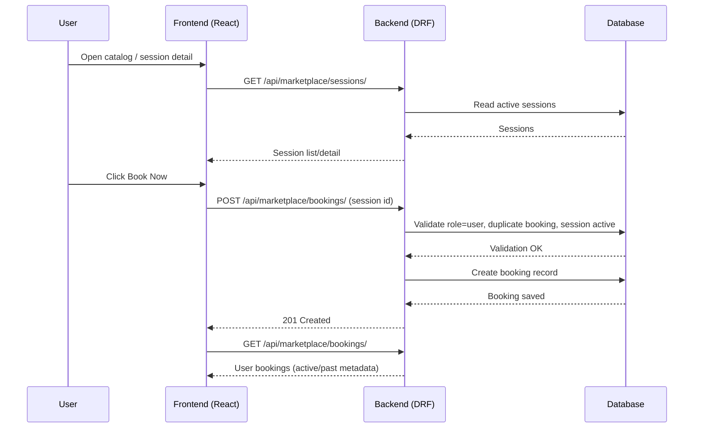
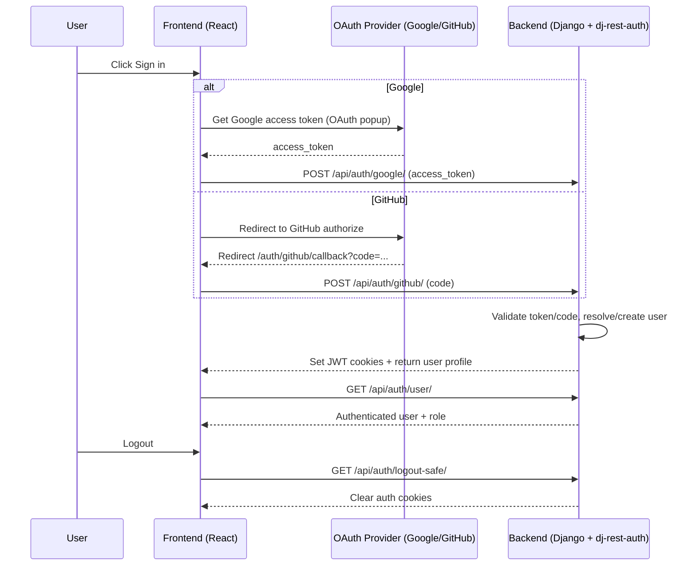

# Ahoum Sessions - Session Booking Marketplace

A full-stack, fully dockerized session booking platform. This platform is designed as a portfolio piece and assignment deliverable, with a clean one-click setup so reviewers can immediately understand the architecture and run the project.

## 🚀 Architecture Overview

This project is built with a production-ready, multi-container Docker setup:

- **Frontend:** React (Vite)
- **Backend:** Django & Django REST Framework (DRF)
- **Database:** PostgreSQL
- **Reverse Proxy:** Nginx
- **Authentication:** JWT cookies via `dj-rest-auth`, Google OAuth, and GitHub OAuth

The infrastructure is entirely **one-click**. A custom `entrypoint.sh` automatically handles Django startup tasks, including database migrations.

## 🧭 Pages Implemented

| Page              | Route                       | Purpose                                                                |
| ----------------- | --------------------------- | ---------------------------------------------------------------------- |
| Home / Catalog    | `/`                         | Public session listing with login CTA and quick booking access         |
| Session Detail    | `/sessions/:sessionId`      | Full session info and **Book Now** action                              |
| Auth Flow         | OAuth redirect + callback   | Google token login and GitHub OAuth code flow with JWT cookie session  |
| User Dashboard    | `/dashboard` (role=user)    | Active/past bookings and profile access                                |
| Creator Dashboard | `/dashboard` (role=creator) | Session CRUD, activation toggle, and booking overview for own sessions |

## 📋 Prerequisites

- **Docker-desktop** installed on your machine and engine running during installation
- **Git**

## 🛠️ Installation & Setup (One-Click Boot)

### 1. Clone the repository

```bash
git clone <YOUR_GITHUB_REPO_URL>
cd ahoum-sessions
```

### 2. Configure Environment Variables

Create a `.env` file in the root directory. You can copy the provided example file:

```bash
cp .env.example .env
```

Ensure your `.env` file contains the following structure (replace with your secure values):

```env
# Django Security
DJANGO_SECRET_KEY=your-secure-random-string
DJANGO_DEBUG=True

# PostgreSQL Database
POSTGRES_USER=ahoum_user
POSTGRES_PASSWORD=your-secure-db-password
POSTGRES_DB=ahoum_sessions_db

# Google OAuth Credentials
GOOGLE_CLIENT_ID=your-google-client-id.apps.googleusercontent.com
GOOGLE_SECRET_KEY=your-google-client-secret

# GitHub OAuth Credentials
GITHUB_CLIENT_ID=your-github-client-id
GITHUB_SECRET_KEY=your-github-client-secret

# Frontend OAuth Client IDs
VITE_GOOGLE_CLIENT_ID=your-google-client-id.apps.googleusercontent.com
VITE_GITHUB_CLIENT_ID=your-github-client-id
```

### 3. Build and Run the Application

Run the following command to build the images and start the system.

> Note: The custom entrypoint script will automatically apply all Django database migrations in the background.

```bash
docker compose up -d --build
```

### 4. Create an Admin Account

To manage the database and social auth settings, create a superuser:

```bash
docker compose exec backend python manage.py createsuperuser
```

## 🌐 Accessing the Application

Once the containers are running, you can access the different services at:

- Frontend App: http://localhost:5173
- Django Admin Panel: http://localhost:8000/admin
- Backend API (via Nginx): http://localhost/api/
- Backend API (direct Django debug): http://localhost:8000/api/

## 🛡️ Rate Limiting (Nginx)

Rate limiting is implemented at the Nginx edge so abusive bursts are blocked **before** hitting Django.

### Why Nginx-based rate limiting?

- Protects sensitive endpoints from brute-force and abuse.
- Reduces backend load by rejecting excessive requests early.
- Keeps policy centralized and easy to tune without app-code changes.

### Applied policy

- `api_general`: `120 requests/minute` per IP (all `/api/` traffic)
- `auth_sensitive`: `10 requests/minute` per IP with small burst
  - `/api/auth/google/`
  - `/api/auth/github/`
  - `/api/auth/registration/`
- `booking_sensitive`: `20 requests/minute` per IP with burst
  - `/api/marketplace/bookings/`

When a limit is exceeded, Nginx returns `429 Too Many Requests`.

### End-to-end procedure used in this project

1. Define Nginx zones in [nginx/nginx.conf](nginx/nginx.conf):
   - `limit_req_zone $binary_remote_addr ...`
2. Attach stricter `limit_req` rules to sensitive `location` blocks.
3. Keep a broader `limit_req` for general `/api/` traffic.
4. Route frontend API calls through Nginx by default in [frontend/src/api/axios.ts](frontend/src/api/axios.ts):
   - default base URL: `http://localhost/api/`
5. Validate and apply config:

```bash
docker compose exec nginx nginx -t
docker compose restart nginx
```

6. Verify limits by burst-testing a sensitive endpoint and checking for `429` responses.

## 🔐 Google OAuth Setup Instructions

To enable Google Login, you must generate credentials in the Google Cloud Console and link them to this project.

### Step 1: Google Cloud Console Configuration

1. Go to the Google Cloud Console.
2. Create a new project (or select an existing one).
3. Navigate to **APIs & Services > OAuth consent screen**. Choose **External** and fill in the required app details.
4. Navigate to **APIs & Services > Credentials**.
5. Click **Create Credentials > OAuth client ID**.
6. Select **Web application** as the application type.
7. Under **Authorized JavaScript origins**, add:

```text
http://localhost:5173 (Frontend)
http://127.0.0.1:5173
```

8. Under **Authorized redirect URIs**, add your frontend auth handler (adjust based on your React routing):

```text
http://localhost:5173/auth/callback
http://127.0.0.1:8000/accounts/google/login/callback/
```

9. Click **Create**. Copy your **Client ID** and **Client Secret**.

### Step 2: Django Configuration

1. Paste your new Client ID and Client Secret into your root `.env` file:

```env
GOOGLE_CLIENT_ID=your-copied-client-id
GOOGLE_SECRET_KEY=your-copied-client-secret
```

2. Restart your Docker containers to apply the new environment variables:

```bash
docker compose up -d
```

3. Go to the Django Admin panel (`http://localhost:8000/admin`) and log in.
4. Navigate to **Sites > Sites**. Edit the default `example.com` site:
   - Domain name: `localhost:8000`
   - Display name: `Ahoum Sessions`

   Save the changes.

5. The backend is now fully configured to accept Google OAuth tokens and issue JWTs to the React frontend.

## 🔐 GitHub OAuth Setup Instructions

1. Go to **GitHub Settings > Developer settings > OAuth Apps**.
2. Create a new OAuth App.
3. Use these values:

```text
Application name: Ahoum Sessions (or your preferred name)
Homepage URL: http://localhost:5173
Authorization callback URL: http://localhost:5173/auth/github/callback
```

4. Copy the **Client ID** and **Client Secret**.
5. Add them to your root `.env` file:

```env
GITHUB_CLIENT_ID=your-github-client-id
GITHUB_SECRET_KEY=your-github-client-secret
VITE_GITHUB_CLIENT_ID=your-github-client-id
```

6. Restart containers:

```bash
docker compose up -d --build
```

## 🧩 RBAC Matrix

### Roles

- **User**: Browse sessions, book sessions, view own bookings, manage own profile.
- **Creator**: Create/update/activate/deactivate/delete own sessions, view booking overview for own sessions, manage own profile.

### Dashboards

| Dashboard         | Role    | Capabilities                                                      |
| ----------------- | ------- | ----------------------------------------------------------------- |
| User Dashboard    | User    | Active bookings, past bookings, profile access                    |
| Creator Dashboard | Creator | Session management (CRUD + activate/deactivate), booking overview |

### API Access Matrix

| Endpoint                                       | User                      | Creator                   | Public |
| ---------------------------------------------- | ------------------------- | ------------------------- | ------ |
| `GET /api/marketplace/sessions/`               | ✅                        | ✅                        | ✅     |
| `GET /api/marketplace/sessions/:id/`           | ✅                        | ✅                        | ✅     |
| `POST /api/marketplace/sessions/`              | ❌                        | ✅                        | ❌     |
| `PATCH/DELETE /api/marketplace/sessions/:id/`  | ❌                        | ✅ (own sessions only)    | ❌     |
| `GET /api/marketplace/sessions/mine/`          | ❌                        | ✅                        | ❌     |
| `GET /api/marketplace/sessions/mine-bookings/` | ❌                        | ✅                        | ❌     |
| `POST /api/marketplace/bookings/`              | ✅                        | ❌                        | ❌     |
| `GET /api/marketplace/bookings/`               | ✅ (own bookings)         | ❌                        | ❌     |
| `PATCH /api/auth/user/`                        | ✅ (username/avatar only) | ✅ (username/avatar only) | ❌     |

### Auth Endpoints

- Google login: `POST /api/auth/google/`
- GitHub login: `POST /api/auth/github/`
- CSRF-safe logout: `GET /api/auth/logout-safe/`

## 🔄 Sequence Diagrams

### Booking Flow



### OAuth + JWT Session Flow



## ✅ Demo Walkthrough (60-90 Seconds)

Use this quick path to validate all key features during review:

1. Start services:

```bash
docker compose up -d --build
```

2. Open app at `http://localhost:5173`.
3. Sign in as a **Creator** using Google or GitHub.
4. Go to **Dashboard** and create a session with future start/end time.
5. Verify in Creator Dashboard:
   - Session appears in **Your Sessions**.
   - You can edit, activate/deactivate, and delete it.
   - **Booking Overview** is initially empty.
6. Open **Home / Catalog** and confirm the session is visible when active.
7. Open **Session Detail** (`/sessions/:sessionId`) and verify full info renders.
8. Logout, then sign in as a **User**.
9. Open the same session detail page and click **Book Now**.
10. Verify User Dashboard:
    - Booking appears in **Active Bookings**.
    - It later moves to **Past Bookings** after session end time.
11. Sign back in as Creator and verify **Booking Overview** now shows the user booking.

Expected RBAC checks during demo:

- User cannot create/manage sessions.
- Creator cannot create bookings.
- Creator can only manage their own sessions.
- Profile updates allow username/avatar only.

## 🛑 Stopping the Application

To stop the application while preserving your database data:

```bash
docker compose down
```

To stop the application and completely wipe the database volume:

```bash
docker compose down -v
```

---
